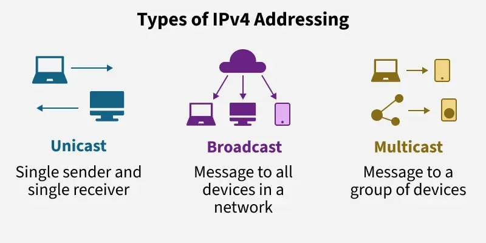

#+title: ARP
#+subtitle: Address Resolution Protocol
#+language: en
[[wikipedia:Address Resolution Protocol]] 
* Summary
Link hosts using [[org:../INFOR/DOCU/NETWORK/MAC.org][mac]] address with an internet layer address (ipv4 for eg.). It gave the ability to send packets trough a network.
* [[https://www.geeksforgeeks.org/computer-networks/what-is-ipv4/][ipv4]] :ATTACH:
#+CAPTION: Types of IPv4
#+ATTR_ORG: :width 300

